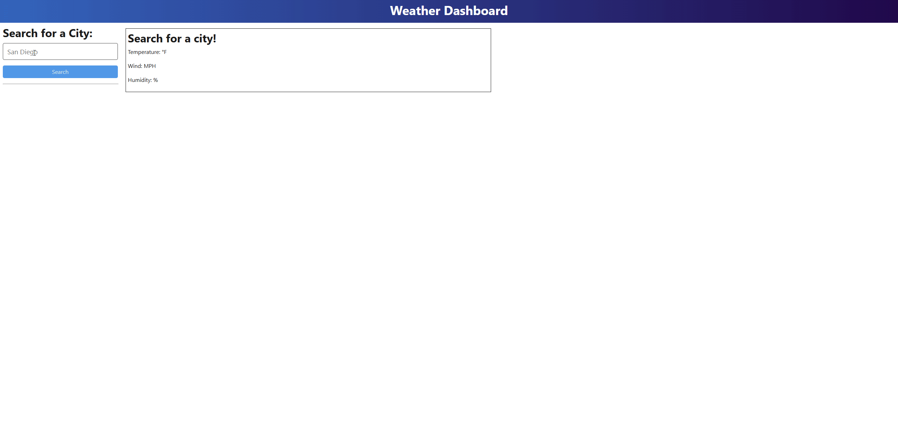

# Weather Dashboard

A simple web application that lets you search for a city’s current weather and 5‑day forecast using the OpenWeather API, built with a TypeScript + Node.js back end and a Vite‑powered TypeScript front end.

---

## Table of Contents

- [Demo](#demo)  
- [Features](#features)  
- [Tech Stack](#tech-stack)  
- [Prerequisites](#prerequisites)  
- [Installation](#installation)  
- [Configuration](#configuration)  
- [Project Structure](#project-structure)  
- [Usage](#usage)  
- [Available Scripts](#available-scripts)  
- [Acknowledgements](#acknowledgements)  
- [License](#license)  

---

## Demo

  


---

## Features

- 🔍 Search current weather by city name  
- 📆 View 5‑day forecast (at 3‑hour intervals)  
- 🔖 Persist search history in a local JSON file  
- ♻️ Easily extendable with modular services and routes  

---

## Tech Stack

- **Back End**: Node.js, Express, TypeScript  
- **Front End**: Vite, TypeScript, plain HTML & CSS (Normalize + custom styles)  
- **Utilities**: Day.js for date formatting, dotenv for configuration  
- **Data Storage**: JSON file for search history (no database required)  

---

## Prerequisites

- **Node.js** v14 or higher  
- **npm** (comes with Node.js)  

---

## Installation

1. **Clone the repo**  
```bash
   git clone https://github.com/Ajthompson88/weather-dashboard.git

   cd weather-dashboard
```

## Configuration

.env

OPENWEATHER_API_KEY=your_openweather_api_key_here
PORT=3000

## Project Structure
```
    WeatherAPI/
    ├── client/                          # Frontend code
    │   ├── public/                      # Static assets (e.g., images, icons)
    │   │   ├── favicon.ico
    │   │   └── index.html               # Main HTML file
    │   ├── src/                         # Source code for the frontend
    │   │   ├── assets/                  # Frontend-specific assets (e.g., styles, images)
    │   │   │   ├── styles.css           # Custom CSS styles
    │   │   │   └── normalize.css        # Normalize CSS
    │   │   ├── main.ts                  # Main entry point for the frontend
    │   │   ├── components/              # Reusable UI components
    │   │   │   ├── WeatherCard.ts       # Component for displaying weather info
    │   │   │   └── SearchHistory.ts     # Component for displaying search history
    │   │   └── utils/                   # Utility functions for the frontend
    │   │       └── formatDate.ts        # Utility for formatting dates
    │   ├── tsconfig.json                # TypeScript configuration for the frontend
    │   └── vite.config.ts               # Vite configuration
    ├── server/                          # Backend code
    │   ├── src/                         # Source code for the backend
    │   │   ├── routes/                  # API routes
    │   │   │   ├── api/                 # API-specific routes
    │   │   │   │   ├── historyRoutes.ts # Routes for search history
    │   │   │   │   └── weatherRoutes.ts # Routes for weather data
    │   │   │   └── index.ts             # Main router file
    │   │   ├── service/                 # Service layer for business logic
    │   │   │   ├── historyService.ts    # Service for managing search history
    │   │   │   └── weatherService.ts    # Service for fetching weather data
    │   │   ├── data/                    # Data storage
    │   │   │   └── searchHistory.json   # JSON file for persisting search history
    │   │   ├── utils/                   # Utility functions for the backend
    │   │   │   └── logger.ts            # Utility for logging
    │   │   ├── app.ts                   # Express app setup
    │   │   └── server.ts                # Server entry point
    │   ├── tsconfig.json                # TypeScript configuration for the backend
    │   └── .env                         # Environment variables (e.g., API keys, port)
    ├── docs/                            # Documentation assets
    │   ├── demo.gif                     # Demo GIF for the README
    │   └── screenshots/                 # Screenshots for the README
    ├── .gitignore                       # Git ignore file
    ├── README.md                        # Project README
    ├── package.json                     # Project dependencies and scripts
    ├── package-lock.json                # Lockfile for npm dependencies
    └── .env                             # Environment variables (e.g., API keys, port)
```

## Usage

1. **Start the Application in Development Mode:**
   - Run the following command to start both the backend and frontend in development mode:
     ```bash
     npm run start:dev
     ```
   - The backend will run on `http://localhost:3000` (or the port specified in your `.env` file).
   - The frontend will run on `http://localhost:5173`.

2. **Start the Application in Production Mode:**
   - Build the frontend and start the backend server:
     ```bash
     npm start
     ```
   - The backend will serve the frontend static files and run on the port specified in your `.env` file (default: `3000`).

3. **Search for a City:**
   - Open the frontend in your browser (`http://localhost:5173` in development or the backend URL in production).
   - Enter a city name in the search bar and click "Search."
   - View the current weather and 5-day forecast for the city.

4. **View Search History:**
   - The search history is displayed in the sidebar.
   - Click on a city in the history to view its weather again.

5. **Delete a City from the Search History:**
   - Click the "Delete" button next to a city in the search history to remove it.

## Available Scripts

In the project directory, you can run the following scripts:

### `npm install`
Installs all dependencies for both the backend (`server/`) and frontend (`client/`).

---

### `npm start`
Builds the frontend and starts the backend server in production mode.

- **Frontend**: The static files are built and served.
- **Backend**: The server runs on the port specified in the `.env` file (default: `3000`).

---

### `npm run start:dev`
Starts both the backend and frontend in development mode with live reloading.

- **Backend**: Runs using `nodemon` for live reloading.
- **Frontend**: Runs on a Vite development server (default: `http://localhost:5173`).

---

### `npm run server`
Starts the backend server in production mode.

---

### `npm run server:dev`
Starts the backend server in development mode with live reloading.

---

### `npm run client:build`
Builds the frontend for production and outputs the static files to the `dist/` directory.

---

### `npm run client:dev`
Starts the frontend development server using Vite.

---

### `npm run build`
Builds the frontend for production. This is an alias for `npm run client:build`.

---

### `npm run render-build`
Installs dependencies and builds the project for deployment on Render or similar platforms.

---

### `npm test`
Currently, this script is a placeholder and does not run any tests. You can update it to include your test suite in the future.


## Acknowledgements

For a lot of error checking and correcting my errors, ChatGPT and Copilot were invaluable on this project. 

Charlie Puente - TA - was very instrumental in helping me wouk through errors and figuring out the little details to get this project to deploy. 

Ainsley Ellis - Tutor - was very detailed with any question that I had and was extremely knowledgable and could diagnose problems quickly and accurately. 

## License

This project is licensed under the [MIT License](LICENSE).